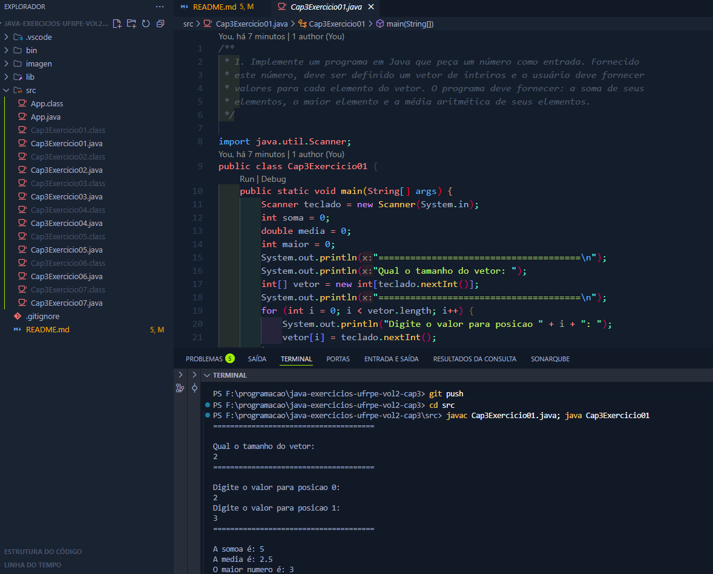
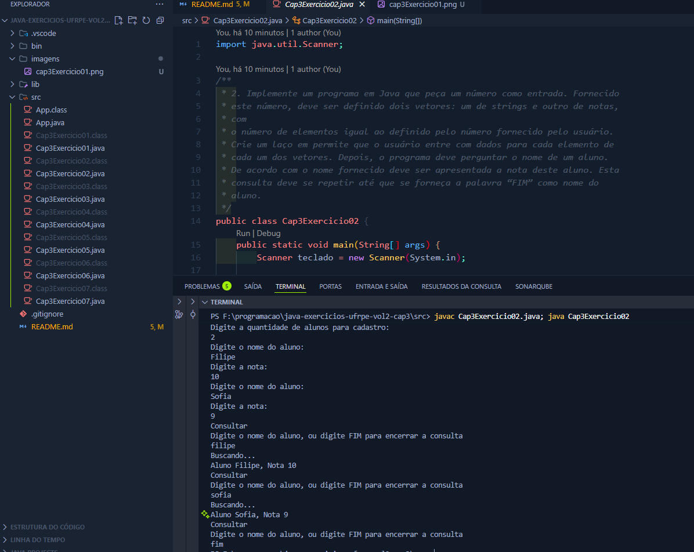
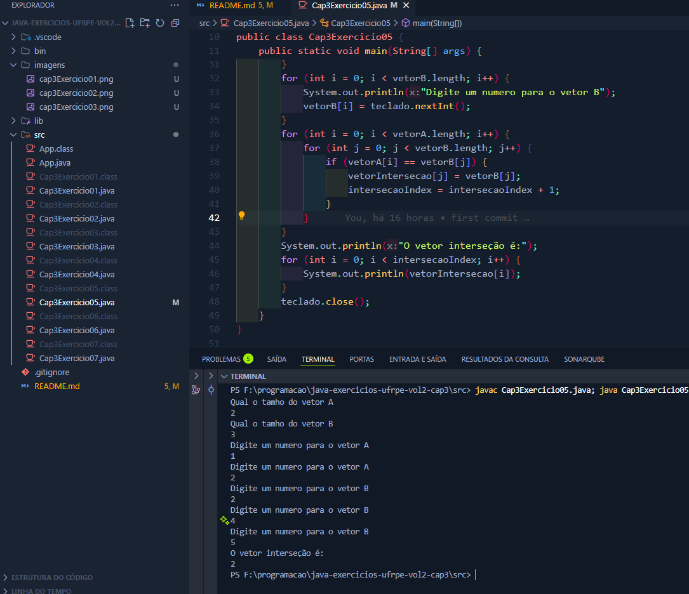

# Programação II - Exercícios Capítulo 3 (Volume 2) - UFRPE EAD

Este projeto reúne os exercícios do Capítulo 3(Vetores, Matrizes e
Captura de Dados pelo Teclado) do Volume 2 da apostila da disciplina de Programação II, do curso de Bacharelado em Sistemas de Informação (EAD) da UFRPE.

Cada exercício foi implementado em uma classe Java separada, com um menu principal para facilitar a execução. O objetivo é aplicar e fixar os conceitos estudados no capítulo.

## Estrutura do Projeto

- `App.java`: Menu principal para acessar cada exercício.
- `Exercicio01.java` a `Exercicio07.java`: Implementações dos exercícios propostos.

## Exercícios

### Exercício 01

**Descrição:** Um programa que recebe um número N, cria um vetor de inteiros com esse tamanho, e calcula a soma, a média aritmética e o maior valor entre todos os elementos.

**Resultado:**



---

### Exercício 02

**Descrição:** Este programa cria dois vetores, um para nomes e outro para notas, e permite que o usuário os preencha. Depois, o programa entra em um laço de consulta, onde é possível buscar a nota de um aluno pelo nome até que a palavra "FIM" seja digitada.

**Resultado:**



---

### Exercício 03

**Descrição:** Um programa interativo para calcular a média de três notas por aluno. A entrada de dados continua até que a palavra "FIM" seja fornecida como nome do aluno. Ao final, o programa informa os nomes e as médias do aluno com a melhor e a pior média geral.

**Resultado:**


---

### Exercício 04

**Descrição:** Uma modificação do exercício anterior, onde o programa primeiro solicita o número de alunos a serem cadastrados. Após a entrada de todos os dados, ele imprime a lista de alunos com suas médias, primeiro em ordem crescente de média e, em seguida, em ordem alfabética.

**Resultado:**


---

### Exercício 05

**Descrição:** Este programa lê dois vetores de inteiros de tamanhos definidos pelo usuário e, em seguida, identifica e imprime todos os elementos que são comuns a ambos os vetores (a interseção).

**Resultado:**



---

### Exercício 06

**Descrição:** Um programa para realizar a soma de duas matrizes de inteiros. O usuário especifica o número de linhas e colunas e insere os valores de cada elemento das duas matrizes. O programa, então, calcula e exibe a matriz resultante da soma.

**Resultado:**


---

### Exercício 07

**Descrição:** Utiliza uma matriz predefinida com as distâncias em KM entre cinco capitais. O programa solicita que o usuário insira um trajeto (representado por uma sequência de números correspondentes às cidades) e calcula a distância total percorrida.

**Resultado:**


---


## Como baixar e executar o projeto

### 1. Clonar o repositório

No terminal, execute:

```sh
git clone https://github.com/lipeqalves/java-exercicios-ufrpe-vol2-cap3.git
```

Depois, acesse a pasta do projeto:

```sh
cd java-exercicios-ufrpe-vol2-cap3
```

### 2. Compilar e executar o App.java

Entre na pasta `src`:

```sh
cd src
```

Compile o arquivo principal:

```sh
javac App.java
```

Execute o programa:

```sh
java App
```

Assim, o menu será exibido e você poderá escolher qual exercício rodar.


#### Exemplo do menu exibido

```text
===== MENU DE EXERCÍCIOS =====
1 - Exercício 01
2 - Exercício 02
3 - Exercício 03
4 - Exercício 04
5 - Exercício 05
6 - Exercício 06
7 - Exercício 07
0 - Sair
Escolha uma opção:
```

### Opção alternativa: Executando cada exercício separadamente

1. Abra o terminal e navegue até a pasta `src` do projeto.

2. Compile a classe desejada, por exemplo:

```sh
javac Exercicio03.java
```

3. Execute a classe compilada:

```sh
java Exercicio03
```

4. Repita para qualquer outro exercício, trocando o nome da classe conforme necessário.

---

Projeto desenvolvido para fins acadêmicos - UFRPE EAD
